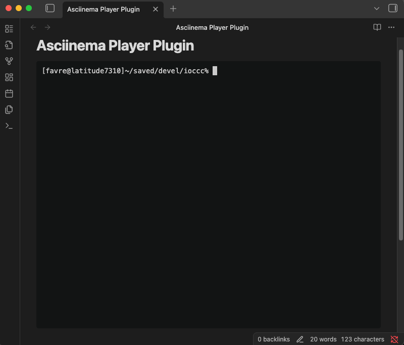

# Asciinema Player Plugin for Obsidian

[](https://github.com/deeplook/obsidian-asciinema-player/actions/workflows/ci.yml)
[](https://github.com/deeplook/obsidian-asciinema-player/releases)
[](https://github.com/deeplook/obsidian-asciinema-player/blob/main/manifest.json)
[](LICENSE)
[](https://github.com/deeplook/obsidian-asciinema-player/releases)
[](https://obsidian.md/plugins?id=asciinema-player)
<br/>
[](https://www.typescriptlang.org/)
[](https://asciinema.org/a/748822)
[](https://www.buymeacoffee.com/deeplook)



This is an [Obsidian](https://obsidian.md) plugin to embed terminal recordings made with [Asciinema](https://asciinema.org) inside Markdown files. These recordings, also known as [asciicasts](https://github.com/asciinema/asciinema/blob/develop/doc/asciicast-v2.md), or shorter: casts, can then be rendered inside Obsidian notes with the interactive [Asciinema Player](https://docs.asciinema.org/manual/player/) UI. Many example recordings are available on [Asciinema.org](https://asciinema.org).

## Installation

### From Obsidian community plugins list

**N.B.: Registration as a community plugin is [pending](https://github.com/obsidianmd/obsidian-releases/pull/8175)...** Once accepted by Obsidian you can install it as follows: open Obsidian settings, turn on community plugins if not done yet, browse community plugins, search "Asciinema Player", install and enable it.

### Manually

1. Download the ready-to-use zipped archive from the [latest releases](https://github.com/deeplook/obsidian-asciinema-player/releases) page on GitHub (named after the plugin id and version tag e.g., `obsidian-asciinema-player-1.0.5.zip`).
2. Unzip it.
3. Move the extracted `obsidian-asciinema-player` folder into your vault's `.obsidian/plugins` folder.
4. Then enable the plugin in the "Community Plugins" tab in Obsidian's settings, like when installing any registered community plugin. Example:

```shell
curl -O https://github.com/deeplook/obsidian-asciinema-player/releases/download/1.0.5/obsidian-asciinema-player-1.0.5.zip
unzip obsidian-asciinema-player-1.0.5.zip
mv obsidian-asciinema-player /path/to/your-vault/.obsidian/plugins/
```

## Usage

### Install `asciinema` and Create Recordings

To create your own asciicasts install the `asciinema` CLI tool and make some example recordings as described in the Asciinema [Getting-Started](https://docs.asciinema.org/getting-started/#recording) documentation.

You can also download examples from [Asciinema.org](https://asciinema.org), e.g. https://asciinema.org/a/748822.cast and save them to some place in your Obsidian vault.

### Embed Asciicasts into Obsidian Notes

To embed an asciicast into an Obsidian note, use a Markdown code block with the language identifier `asciinema` where the first line inside the block must be a reference to the desired `.cast` file:

- For **local files**, use the Obsidian paths starting at the vault's root (e.g., `_attachments/748822.cast`).
- For **remote files**, prefix the URL with `src:` (e.g., `src: https://asciinema.org/a/748822`).
 
````markdown
```asciinema
src: https://asciinema.org/a/748822
```
````

````markdown
```asciinema
_attachments/748822.cast
```
````

#### Options

You can customize the player by adding options as key-value pairs after the file path.

| Key             | Type      | Description                                                                                  |
| --------------- | --------- | -------------------------------------------------------------------------------------------- |
| `cols`          | `number`  | Set the number of columns for the terminal.                                                  |
| `rows`          | `number`  | Set the number of rows for the terminal.                                                     |
| `autoPlay`      | `boolean` | Start playback automatically.                                                                |
| `loop`          | `boolean` | Loop the playback.                                                                           |
| `speed`         | `number`  | Set the playback speed (e.g., `2` for double speed).                                         |
| `theme`         | `string`  | Set the color theme (e.g., `dracula`, `solarized-dark`).                                     |
| `startAt`       | `string`  | Start playback at a specific time (e.g., `1:23`).                                            |
| `idleTimeLimit` | `number`  | Limit terminal inactivity to a maximum number of seconds.                                    |
| `poster`        | `string`  | Set the poster (preview) frame, e.g., `npt:1:23` shows the frame at 1 minute 23 seconds.     |

#### Example with Options

Here is an example demonstrating how to use multiple options (entries can be commented with a `#`):

````markdown
```asciinema
_attachments/demo.cast
cols: 100
rows: 25
autoPlay: true
loop: true
speed: 1.5
theme: solarized-dark
```
````

The UI provides interactive features with keyboard shortcuts for playing, pausing, jumping, and even chapter markers in the play bar when specified inside the asciicasts.

## Update the Plugin

Instead of loading the `asciinema-player` from an external CDN (Content Delivery Network), this plugin **bundles** the entire library directly into its code. While this results in a larger initial file size, it guarantees that the player will work every time, even if you are offline or if the external CDN is unavailable. This trade-off makes for a more robust and dependable Obsidian plugin.

If the `asciinema-player` library is updated, and you think you need the newest version, but it's not bundled in this Obsidian plugin, you will need to update it within the plugin manually:

### Prepare the Build Environment

If you want to rebuild or modify the plugin, first install the tooling and dependencies:

```shell
npm install -g pnpm
pnpm install
```

After rebuilding you can remove the `node_modules` directory again to keep the plugin folder lean:

```shell
rm -rf node_modules
```

### 1. Check for Updates

To see if a new version of `asciinema-player` is available, run the following command in the plugin's directory:

```shell
pnpm outdated asciinema-player
```

### 2. Update the Library

If an update is available, run this command:

```shell
pnpm update asciinema-player
```

This will download the latest version and update the `package.json` and `pnpm-lock.yaml` files.

### 3. Rebuild the Plugin

After the update is complete, you must rebuild the plugin to include the new library code:

```shell
pnpm run build
```

### 4. Test

Finally, after rebuilding, reload Obsidian and test the plugin thoroughly to ensure the update has not introduced any issues, especially for major version updates.
